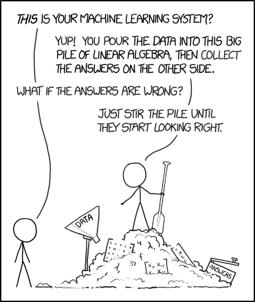
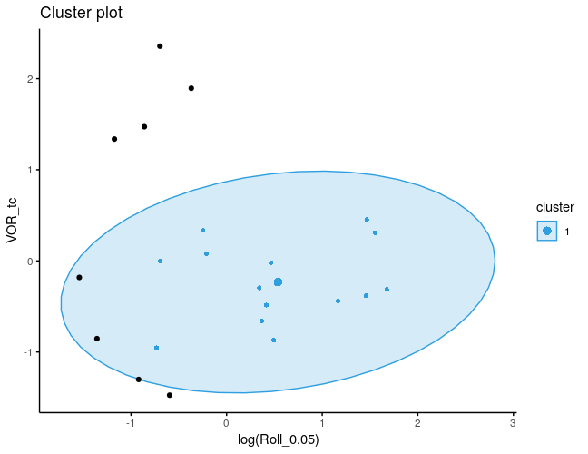
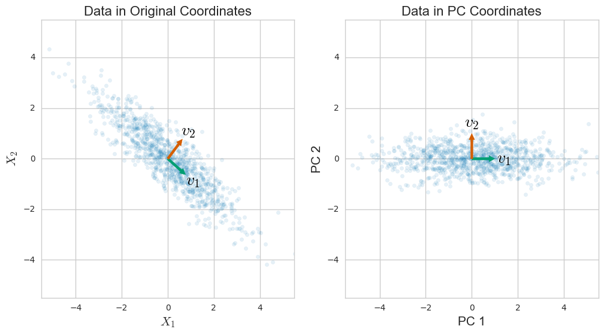
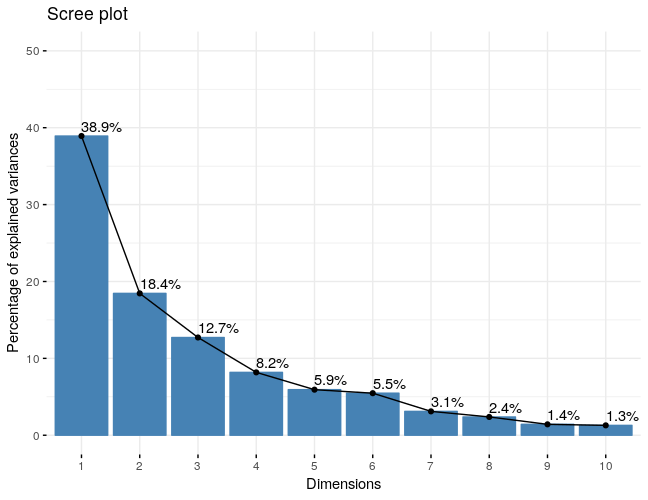
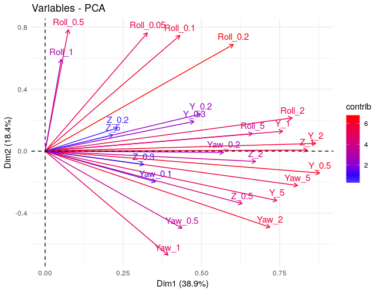
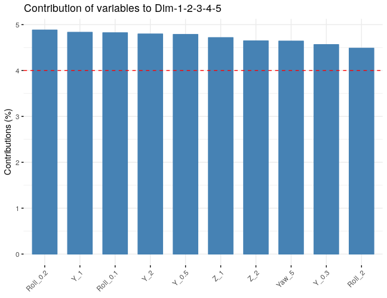

## Farzad

&nbsp;

&nbsp;

- Mechanical Engineering, BS, University of Tehran
- Biomedical Engineering, MS, Delft University of Technology
- Neuroscience, PhD, University of Maryland


## Machine Learning and Big Data

&nbsp;

It's like sex in high school: 

- Nobody knows how to do it properly  
- But everyone thinks everyone else is doing it
- So everyone says they are doing it, too.  \ \ \  -Dan Ariely, Duke University  

&nbsp;

Too much hype. Is it that good?!

## Very Easy yet very difficult!

```{r v0, echo=FALSE, cache=FALSE, out.width = '55%', fig.align="center"}

```


## Progress in Problem solving

&nbsp;

- "Big breakthroughs happen when what is suddenly possible meets what is desperately needed."   \  \ \ \ \ \ \ \ \ \ \ \  -Thomas Friedman, The New York Times


## Machine learning

&nbsp;

- Supervised learning

- Unsupervised learning

- Reinforcement learning


## Unsupervised learning

&nbsp;

- Clustering
    + Fuzzy clustering
    + Density based clustering
    

- Blind signal separation
    + Principal Component Analysis (PCA)
    + Non-negative matrix factorization


## Terminology

- Training and test data

- Truth labels

- Features and target variables (feature engineering)

- Transformations and Normalizations

- Choice of learner:
    + High bias and many assumptions: LDA, naive Bayes
    + Few/no assumptions but high variance: Decision trees, NN

- Performance metric: accuracy, precision-recall, AUC (ROC), ...

- Obstacles:
    + Overfitting
    + Curse of dimensionality
    + Data leakage
    + ...

    
```{r , echo=FALSE, cache=FALSE, out.width = '25%', fig.align="center"}
# knitr::include_graphics('4_1.png')
```

## Fuzzy logic

&nbsp;

- Lotfi Zadeh (1965)
```{r v1, echo=FALSE, cache=FALSE, out.width = '40%', fig.align="right"}
knitr::include_graphics('zadeh.jpg')
```

- Mathematics of Fuzzy Sets
```{r v2, echo=FALSE, cache=FALSE, out.width = '50%', fig.align="right"}
knitr::include_graphics('temp.svg')
```

## Why fuzzy?!

&nbsp;

- Geometry of the data  

- Real world datasets are messy and fuzzy!

```{r v3, echo=FALSE, cache=FALSE, out.width = '100%', fig.align="center"}
knitr::include_graphics('Rplot1.png')
```


## Vestibular migraine data

&nbsp;

- More info: Richard Lewis, ..., Daniel Merfeld, J Vestibular Research, 2011

- Roll tilt threshold, DHI, VOR (time constant)

## Fuzzy clustering

- Partition the space to c fuzzy clusters (assign centroids)

- Assign memberships:
    + Minimize within cluster variability
    + Maximize between cluster variability

- Calculate new centroids and repeat optimization
    + argmin($\Sigma \Sigma w_{ij}^m||x_i-c_j||^2$ )

## Clusters

```{r v4, echo=FALSE, cache=FALSE, out.width = '80%', fig.align="center"}
knitr::include_graphics('Rplot2.png')
```

## Important points

&nbsp;

- Need to know number of clusters!

- Transform and normalize your data appropriately

- Examine cluster results accross different feature sets

- The choice of m (degree of fuzziness)
    + Run sensitivity analysis

## Density-based clustering

```{r v5, echo=FALSE, cache=FALSE, out.width = '100%', fig.align="center"}
knitr::include_graphics('clusters.png')
```

## DBSCAN

- Density-based spatial clustering of applications with noise

- minPts and $\epsilon$

```{r v6, echo=FALSE, cache=FALSE, out.width = '70%', fig.align="center"}
knitr::include_graphics('DBSCAN.svg')
```

## Clusters

```{r v7, echo=FALSE, cache=FALSE, out.width = '80%', fig.align="center"}

```

## Performance evaluation

&nbsp;

- Cross-validation

- Build a test set

- Internal validity
    + Silhouette Coefficient
    + Calinski-Harabaz Index (AKA Variance Ratio Criterion)


## Curse of dimensionality

&nbsp;

- Intuition fails in high dimentions

- Feature engineering (domain-specific knowledge)

- Concepts of similarity and neighborhood break down

- Dimensionality reduction

## PCA

- Finding the directions that maximizes variability
    + Span the space using the basis formed by eigen vectors
&nbsp;

```{r v8, echo=FALSE, cache=FALSE, out.width = '100%', fig.align="center"}

```

## Vestibular thresholds

&nbsp;

- More info: Yulia Valko, ..., Daniel Merfeld, J Neuroscience, 2012

- Roll, Yaw, Y, Z

- Frequencies: 0.05-5 Hz

- Features: 21

## Correlations

```{r v9, echo=FALSE, cache=FALSE, out.width = '80%', fig.align="center"}
knitr::include_graphics('Rplot4.png')
```

## Principal components (PCs)

```{r v10, echo=FALSE, cache=FALSE, out.width = '80%', fig.align="center"}

```

## How to understand PCs

```{r v11, echo=FALSE, cache=FALSE, out.width = '80%', fig.align="center"}

```

## Top features

```{r v12, echo=FALSE, cache=FALSE, out.width = '80%', fig.align="center"}

```

## Non-negative matrix factorization (NMF)

&nbsp;

- Lee and Seung (2001)

- Sensorimotor control of movement (Bizzi's group at MIT 2003)

- Image recognition, text mining, spectral analysis, bioinformatics, ...

&nbsp;

$V = W.H$

- Vestibular data: 5 principal components (0-6)
    + Computed thresholds

## Keep in mind

&nbsp;

- More data always beats smarter algorithms (no data no knowledge)

- Spend a lot of time on feature engineering

- Less is not always more (model ensembles)

- Cross-validation

- In predictive modeling, generalization is all that matters


```{r , echo=FALSE, cache=FALSE, out.width = '40%', fig.align="center"}
# knitr::include_graphics('10_1.png')
```

## Questions


